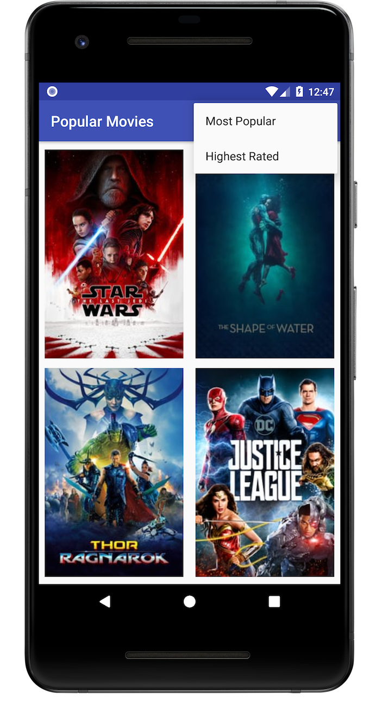
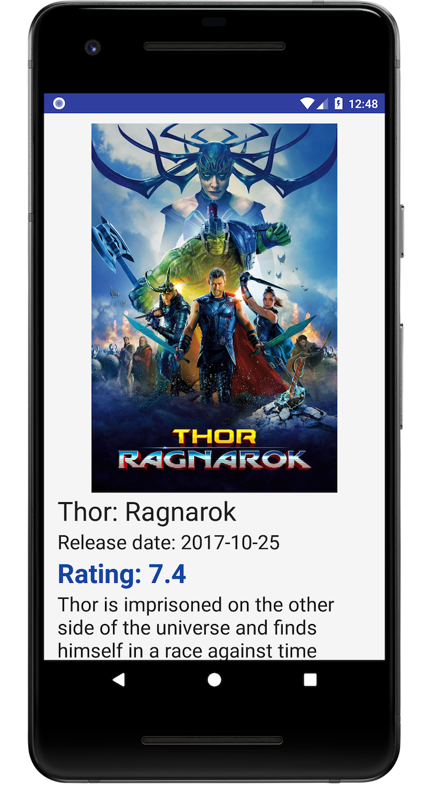

# Popular Movies Project

[image1]: ./repo_images/screen_01.png "Screen 1"
[image2]: ./repo_images/screen_02.png "Screen 2"

## Project Overview
Most of us can relate to kicking back on the couch and enjoying a movie with friends and family. In this project was built an app to allow users to discover the most popular movies playing.

## PART I

- Fetch data from the Internet with [theMovieDB](https://www.themoviedb.org) API.
- Use adapters and custom list layouts to populate list views.
- Incorporate libraries to simplify the amount of code you need to write

## How it looks like

